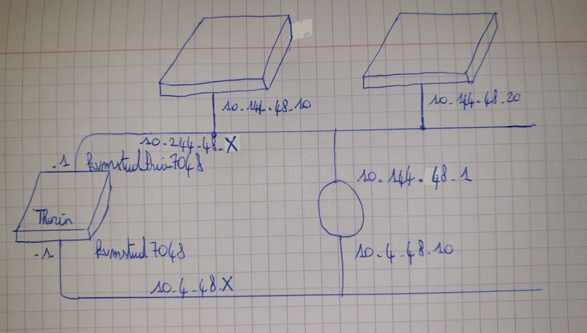

# S1

## Compétences

### Installation de station

#### Montrer la machine nouvellement installée

*Télécharger le fichier iso le plus récent sur le site de Débian
*Installation de Debian

#### Afficher le nom de la station (uname et prompt)
 La commande <code>uname -n</code> permet d'afficher le nom de la station.
 Dans le prompt le nom de la station se trouve '''après le @'''

#### Afficher le nom de l'utilisateur (id et prompt)
 La commande <code>id -un</code> permet d'afficher le nom de l'utilisateur.
 Dans le prompt le nom de l'utilisateur se trouve '''avant le @'''

#### Afficher les 4 paramètres IP

#### L'adresse IP et le masque de sous réseau
 La commande <code>ip a</code> affiche les différentes cartes réseaux
 '''Sur la ligne inet''' on retrouve '''l'adresse ip''' avec le '''masque de sous réseau'''

##### Les routes
 La commande <code>ip route</code> affiche deux routes:
 Une première route pour accéder au '''réseau local'''
 Une deuxième vers la '''passerelle'''

##### Le serveur de nom
 La configuration du serveur de nom est dans le fichier /etc/resolv.conf
 Pour l'afficher: <code>cat /etc/resolv.conf</code>

#### Utilisation Aptitude
 / : rechercher

 n : résultat suivant

 + : sélectionner

 g : installer

 q : quitter 

### Machine virtuelle

#### Montrer la machine virtuelle en fonctionnement
*Création fichier VM: qemu-img create -f qcow2 debian-pavy.qcow2 4G La taille du disque sera de 4G
*Installation Debian: kvm -m 1G -hda debian-pavy.qcow2 -cdrom debian...iso Attention à  ce que le fichier iso soit bien présent dans le même dossier
*Invocation VM: kvm -m 1G -hda debian-pavy.qcow2 Attention à  ce que le fichier qcow2 soit bien présent dans le même dossier

#### arrêt, puis clonage
 arrêt: <code>su</code>
        <code>systemctl poweroff</code>

 clonage: <code>cp debian-pavy.qcow2 'debian-pavy-vde2.qcow2'</code>

#### lancer les deux VMs, avec et sans VDE2
    - Lancer VM sans VDE2: <code>kvm -m 1G -hda debian-pavy.qcow2</code>
    - avec VDE2: <code>kvm -m 1G -hda 'debian-pavy-vde2.qcow2' -net nic,macaddr=42:30:03:01:01:02 -net vde,sock=/var/run/vde2/kvmtap0.ctl/</code>
    - Si le fichier est déjà  sollicité par la 1ère VM on ne peut pas l'utiliser pour la seconde car à§a créerait des conflits et rendrait la VM inutilisable.

#### Différences paramètres IP
  Sur chaque VM:  
    - <code>ip a (inet X.X.X.X/X)</code>  
    - <code>ip route</code>  
    - <code>cat /etc/resolv.conf</code>  

#### Sauvegarde scp sur Thorin
    - <code>scp debian-pavy.qcow2 pavy@thorin:debian-pavy.qcow2</code>

### La variable PATH
 - Lancez 2 sessions avec une session en root

 - Installer net-tools: <code>apt install net-tools</code>

 - Modifier la variable PATH pour root car ifconfig est dans sbin et pas dans bin:
 <code>export PATH=$PATH:/sbin</code>
    
 - <code>echo $PATH</code> pour afficher la variable PATH: on constate que la variable PATH de root
 se termine par /sbin alors que pour l'autre utilisateur elle se termine en /bin

 - Pour identifier la commande ifconfig on utilise: <code>which ifconfig</code>

 - Afin que ifconfig soit accessible depuis l'utilisateur non root il faut changer les droits de ifconfig en root avec <code>chmod 777 /sbin/ifconfig</code>

### Protocole réseau graphique : X Window

 - Démarrage du serveur X avec la commande: <code>startx</code>

 - Ouverture du Windows Manager: Clic Gauche > show icon manager

 - Ouvrir xeyes et xlogo: Debian > jeux > xeyes > xlogo

 - Lancer xterm: Debian > application > Shells > Bash

 - Afficher les informations des écrans connectés avec la commande: <code>xrandr</code>

 - Affichez les informations de la fenêtre d'un terminal xterm avec la commande: <code>xwinfo</code>   puis cliquer sur la fenêtre choisie

 - Basculer entre affichage non graphique et graphique sans arrêter le serveur X avec les touches: Ctrl+alt+F2/3/4/5

### Modification de réseau

### Connexions réseaux

### Installation de serveur (LAMP)

### W1

### W2

# S2: Base des services réseaux

## Connexion Thorin, identification des paramètres

### connexion sans mot de passe vers Thorin

- Générer une paire de clés privée/publique sur machine locale : <code>ssh-keygen</code>

 

Envoi de la clé de Osaka à  thorin:
<code>ssh-copy-id pavy@thorin</code>
  ou bien
 <code>scp .ssh/id_rsa.pub pavy@thorin:</code> => <code>ssh pavy@thorin</code> => <code>cat id_rsa.pub > .ssh/authorized_keys</code>

 La connexion ssh est maintenant instantanée.
 On peut maintenant annuler ces opérations avec <code>ssh-keygen -r pavy@thorin</code>

### liste des adresses dans le Wiki

 - Adresse de la station en Osaka: 10.33.106.3/24

 - Adresse de thorin depuis Osaka(commande <code>host thorin</code>): 10.30.3.4

 - Cartes réseaux sur thorin avec la commande <code>ip a | grep 7048</code> o๠7048 est mon UID: kvmstud7048 (10.4.48.1/24)
                                                                                     kvmstudPriv7048 (10.244.48.1/24)

 - Adresses de réseau avec la commande <code>ip route |grep 7048</code>: 10.4.48.0/24
                                                             10.244.48.0/24

 

### liste des ports VNC utilisés

 Port VNC de base: 5900
 Mes ports VNC : (mon id=7048) donc mes ports VNC 48 / 148 / 248

### xlogo

 Afin d'afficher xlogo de thorin sur la machine locale, On se connecte en ssh en ajoutant <code>-X</code> à  la commande <code>ssh</code>
 Ensuite on entre la commande <code>xlogo</code>.

### affichage des compteurs

'''identification du disque qui contient vos données'''
 La commande <code>df -h</code> permet de lister les disques durs avec leur point de montage.
 Etant donné que mes données sont contenues dans le répertoire /users/stud/1A (commande <code>pwd</code>) alors Le disque dur qui contient mes données est dev/sda6.
 <code>/dev/sda6          7,3T    977G  5,9T  14% /users</code>

'''Utilisation de ce disque'''
 <code>df -h</code> Ce disque de 7,3To est utilisé à  14% (977 Go Utilisés / 5,9 To Libres)

'''Consommation personnelle sur ce disque'''
 <code>du -ah /users/stud/1A/pavy</code> Le fichier fait 2Go.
 <code>2G /users/stud/1A/pavy</code>

'''Utilisation RAM'''
 La commande <code>free -h</code> montre des informations intéressantes à  propos de la RAM:

          total        utilisé     libre      partagé  tamp/cache   disponible
     Mem: 125Gi         3,6Gi       91Gi       42Mi        30Gi       121Gi

'''Utilisation CPU'''

 La commande <code>lscpu</code> permet d'obtenir de nombreuses informations sur le processeur qu'utilise Thorin:

      pavy@thorin:~$ lscpu 
      Architecture:                           x86_64
      Mode(s) opratoire(s) des processeurs:   32-bit, 64-bit
      Boutisme:                               Little Endian
      Tailles des adresses:                   46 bits physical, 48 bits virtual
      Processeur(s):                          40
      Liste de processeur(s) en ligne:        0-39
      Thread(s) par coeur:                    2
      Coeur(s) par socket:                    10
      Socket(s):                              2
      Noeud(s) NUMA:                          2
      Identifiant constructeur:               GenuineIntel
      Famille de processeur:                  6
      Modele:                                 79
      Nom de modele:                          Intel(R) Xeon(R) CPU E5-2630 v4 @ 2.20GHz

 Le nombre de processeurs=40=(threads/cœurs)*(cœurs/sockets)*sockets=2*10*2
      
 La commande <code>uptime</code> permet de connaà®tre la durée d'activité de la machine:

      pavy@thorin:~$ uptime
      09:34:43 up 15:48, 15 users,  load average: 1,67, 1,50, 1,07

### effacement de clef de la machine cible

Sur la machine locale, la commande utilisée afin de supprimer la clé de Thorin est <code>ssh-keygen -R thorin</code>

### fichier contenant une machine juste installée (Ram : 1Go, DD : 10Go)

## Installation d'un routeur sur thorin

### Installation d'un serveur sur Thorin + VNC
 Connexion sur thorin: <code>ssh pavy@thorin -L 7048:localhost:7048</code>

 Creation image spécifique: <code>cp debian-pavy.qcow2 routeur.qcow2</code>

 Lancement du serveur avec le port vnc 48:
 <code>kvm -m 4000 -hda routeur.qcow2 -net nic,macaddr=42:48:04:03:02:01 -net vde,sock=/var/run/vde2/kvmstud7048.ctl -net nic,macaddr=42:48:04:03:02:02 -net vde,sock=/var/run/vde2/kvmstudPriv7048.ctl -vnc :48</code>

 Connexion à  partir de la machine locale: <code>vinagre thorin:48</code>

### Affectation des adresses IP

  <code>#nano /etc/network/interfaces</code>

  allow-hotplug ens3
  iface ens3 inet static 
  address 10.4.48.10/24
  gateway 10.4.48.1

  allow-hotplug ens4
  iface ens4 inet static
  address 10.144.48.1/24

 Configuration du dns:
 <code>#nano /etc/resolv.conf</code>
 nameserver 10.4.48.1

 Redémarrage du routeur

### Tshark

 Installation de tshark: <code>#apt install tshark</code>

 Lancement de tshark: <code>#tshark -n -i ens4</code>
 Ping sur le réseau studPriv à  partir de la machine locale: <code>ping 10.144.48.1</code>

 Lancement de tshark: <code>#tshark -n -i ens3</code>
 Ping sur le réseau studPriv à  partir de la machine locale: <code>ping 10.4.48.10</code>

### Kpartx

 Sur la machine locale => conversion qcow2 en raw:
 
 <code>qemu-img convert -O raw routeur.qcow2 routeur.raw</code>

 Montage kpartx:
 
 <code>#kpartx -av routeur.raw</code>
 <code>#mount /dev/mapper/loop0p1 /tmp</code>

 Accès à  la machine:
 
 <code>#touch /tmp/home/killian/toto</code>
 <code>#umount /tmp</code>
 <code>qemu-img convert -O qcow2 routeur.raw routeur_toto.qcow2</code>
 <code>scp routeur_toto.qcow2 pavy@thorin:</code>

 Sur thorin:
 <code>kvm -m 2G -hda routeur_toto.qcow2 -nographic -vnc :148</code>
 
 Sur machine locale:
 vinagre thorin:148
 Avec ls on voit que le fichier toto est bien là 

## Installation de serveurs Apache, Asterisk

### Création des 3 Machines
 Connexion sur thorin: <code>ssh pavy@thorin</code>
 - Routeur
    hostname ([su -]<code>hostnamectl set-hostname routeur</code>) : routeur
    Gateway+DNS: 10.144.48.1
    Port VNC : 48
Lancement: <code>kvm -m 4G -hda routeur.qcow2 -net nic,macaddr=42:48:04:03:02:01 -net vde,sock=/var/run/vde2/kvmstud7048.ctl -net nic,macaddr=42:48:04:03:02:02 -net vde,sock=/var/run/vde2/kvmstudPriv7048.ctl -vnc :48</code>
 Connexion: <code>vinagre thorin:48</code>
 
 - Serveur WEB (Pour Apache)
    hostname ([su -]<code>hostnamectl set-hostname apache</code>) : apache
    Gateway+DNS: 10.144.48.1
    Port VNC : 148
Lancement: <code>kvm -hda apache.qcow2 -m 2G -net vde,sock=/var/run/vde2/kvmstudPriv7048.ctl/ -net nic,macaddr=42:12:01:02:03:04 -vnc :148</code>
 Connexion: <code>vinagre thorin:148</code>
 
 - Serveur TEL (pour Asterisk)
    hostname ([su -]<code>hostnamectl set-hostname asterisk</code>) : asterisk
    Gateway+DNS: 10.144.48.1
    Port VNC : 248
Lancement: <code>kvm -hda asterisk.qcow2 -m 2G -net vde,sock=/var/run/vde2/kvmstudPriv7048.ctl/ -net nic,macaddr=42:12:02:03:04:05 -vnc :248</code> 
 Connexion: <code>vinagre thorin:248</code>

### Configuration du routeur
 Installation de dnsmasq:
 <code>#apt install dnsmasq</code>

 Définition du pool d'adresses sur routeur.qcow2 (/etc/dnsmasq.d/dnsmasq.d):
 <code>dhcp-range=10.144.12.3,10.144.12.254,255.255.255.0,12H</code>

*On fait un '''nano /proc/sys/net/ipv4/ip_forward''' et on change le '''0''' par un '''1''' pour indiquer à  Linux qu'il faut router.
* On dé-commente la ligne <code>net.ipv4.ip_forward=1</code> dans le fichier '''/etc/sysctl.conf''' pour que la modification précédente soit permanente.

 Adresses fixes pour nos 2 machines:
on ajoute dans le fichier /etc/dnsmasq.d/dnsmasq.d : 
 <code>dhcp-range=10.144.12.3,10.144.12.254,255.255.255.0,12H
 dhcp-host=42:12:01:02:03:04,apache,10.144.48.10,45m
 dhcp-host=42:12:02:03:04:05,asterisk,10.144.48.20,45m</code>

 Définitions des noms (/etc/hosts): 
 <code>127.0.0.1     localhost
 127.0.1.1     routeur
 10.144.48.10  apache
 10.144.48.20  asterisk</code>

### Vérifications
Petit ssh pour vérifier le dns <code>ssh -l killian apache</code> 
 
'''DHCP''':
# On lance une capture sur routeur.qcow2 avec tshark : <code>tshark -ni ens4 port 67</code>
# Sur un des serveurs, on déconnecte et on reconnecte la carte réseau :
<code>su -</code> => <code>ifdown ens3</code> => <code>ifup ens3</code>

On constate que les échanges DHCP s'effectuent bien entre le router et le serveur en question, sur la capture tshark du router.

'''DNS''':
# Sur le router on se sert de tshark : <code>tshark -ni ens4 port 53</code>
# Sur un des serveurs, ping l'autre serveur avec son nom : <code>ping asterisk</code> (si sur apache)

## Partage de fichiers réseaux : nfs, fuse, samba

## Installation wordpress et webdav, script php

## Sauvegarde, restauration mariadb, Synchronisation des données hors d'Osaka

## Recherches de pannes
Commenà§ons par une analyse réseau sur l'interface du routeur ens4 grà¢ce à  tshark

<code>tshark -i ens4 -f tcp </code>

REMARQUE: On repère le début et la fin de la connexion grà¢ce aux paquets SYN et FIN

 Vérification des logs: 
<code>less /var/log/syslog</code>

 Vérification des ports ouverts sur la machine 
<code>nmap IP_MACHINE</code>

 Vérification des ports ouverts en local: 

<code>ss -tunlp</code>

ou: 
<code>ss -pan | grep 80</code>

## Supervision
 Installation de Maria DB 
 apt install mariadb-server
 apt install icinga2
 apt install apache2
 apt install libapache2-mode-php
 apt install icinga2-ido-mysql
 apt install php-mysql
 apt install icingaweb2

## Linux à  la maison

Tout d'abord on commencer par créer sur notre pc en Osaka une paire de clés publique/privée:

<code>ssh-keygen</code>

 
Pour une connexion sans mdp on saute la partie passphrase avec entrée

Envoie de la clé de Osaka à  thorin:
<code>ssh-copy-id pavy@thorin</code>
  ou bien
 <code>scp .ssh/id_rsa.pub pavy@thorin:</code> => <code>ssh pavy@thorin</code> => <code>cat id_rsa.pub > .ssh/authorized_keys</code>
 
Maintenant il suffit de s'envoyer la paire de clés sur son pc personnel par mail par exemple

## SSH, transfert de ports, configuration
A présent on souhaite avoir un accès à  distance directement vers thorin/panama7

Il faut d'abord créer un fichier config dans le dossier ~/.ssh
à‰ditons le avec nano pour spécifier l'hà´te bifrost pour ne plus avoir à  recopier l'addresse ipv6 qui fait 10km:

 host bifrost
 hostname 2001:660:5402:2fe:baac:6fff:fe7f:4223
 port 8163
 localForward 7004 thorin:22
 localforward 7007 panama7:22

On peut maintenant se connecter facilement à  bifrost et à  thorin/panama7:
 bifrost: <code>ssh pavy@bifrost</code>
 thorin(depuis bifrost): <code>ssh thorin</code>
 panama7(depuis bifrost): <code>ssh panama7</code>
 
 panama7 (depuis la maison): <code>ssh bifrost -L 7007:10.30.3.4:22</code> (10.30.3.4 est l'adresse de thorin)

# S3: Techniques d'accès=
## DVB

### Initialisation

 L'adaptateur est bien connecté: <code>ls /dev/dvb</code>

 Installation des paquets w-scan et dvb-apps

 On lance le scan: <code>time w_scan -X -ft > channels.conf 2 > channels.log</code>
 On retrouve dans le fichier "channels.conf" la liste des chaà®nes que l'on peut corréler avec les multiplex https://www.csa.fr/Informer/PAF-le-paysage-audiovisuel-francais/Les-chaines-de-la-TNT:   R1 = 490 MHz (FR2, FR4, franceinfo, F3 PACA, BFM PACA) R2 = 610 MHz (C8, BFM, CNEWS, CSTAR, Gulli) R3 = 546 MHz (C+, C+C, C+S, P+, LCI, Paris Premiere) R4 = 586 MHz (M6, W9, Arte, FR5, 6ter) R6 = 514 MHz (TF1, NRJ12, TMC, TFX, LCP) R7 = 538 MHz (TF1SF, L'Equipe, C25, RMC DEC, RMC STORY) 

https://www.csa.fr/matnt/couverture
( Canal x 8 ) + 306 = Fréquence (MHz)

### Analyse

 Je zappe sur Arte: <code>tzap -c channels.conf "Arte(Multi4)"</code>  <code>status 1f | signal 0000 | snr 0142 | ber 00000000 | unc 00000000 | FE_HAS_LOCK</code> Le ber est égal à  0

 Dans un autre terminal: Installation du paquet dvbsnoop Listage des PID: <code>sudo dvbsnoop -pd 4 -s pidscan >> analyse</code>

 Listage des avis ITU-T: <code>cat analyse | grep ITU-T</code>
 https://www.linuxtv.org/wiki/index.php/Testing_your_DVB_device#Using_dvbsnoop
 L'ITU-T est un organisme qui fixe les normes télécommunications des systèmes audiovisuels et multimédia.

 On reà§oit le flux vidéo MPEG: <code>dvbsnoop 0x0140</code> 0x0140 est le PID hex de Arte(Multi4)

 On peut afficher le nombre de langues disponibles pour le stream: <code>dvbsnoop 300 -n 1 | grep lang</code> o๠300 est le pid decimal de la PMT de Arte -n 1 pour limiter  a une éxecution

### Emissions

 1. Liste des programmes (au sens du DVB):
 <code>dvbsnoop -n 1 -pd 4 0</code>

 2. ServiceID d'Arte=1031:
 <code>dvbsnoop -n 4 -pd 4 17</code>

 3. Débits des PID (max et min):
 <code>dvbsnoop -s bandwidth -n 1000 -pd 2 PID</code> 
 Le PID au débit le plus faible est le TOT (20) et les PIDS au débits max sont les stream 120
 <code>dvbsnoop -s bandwidth -n 1000 -pd 2 20</code>
 <code>dvbsnoop -s bandwidth -n 1000 -pd 2 120</code>

 4. Afficher les deux prochaines émissions de France5:
 Service_ID = 1045
 <code>dvbsnoop -n 4 -pd 4 18</code>
 Et on cherche les prochains programmes qui corresponde au service_id 1045

### Analyseur PRO
 1. Installer le paquet rtl-sdr
 2. <code>rtl_power -f 470M:640M:10k b433.csv</code> Ici on scanne entre 432Mhz et 436Mhz avec 10kHz d'intervalle entre chaque fréquence (résolution)
 3. <code>heatmap.py b433.csv b433.png</code> Génération de la heatmap pour visualiser les fréquences
 4. <code>display b433.png</code> affichage du png

 

### Multicast
 
 '''PC1:''' 
 1. Vérifier que mumudvp n'est pas actif: <code>pgrep -la mumudvb</code>
 2. Si la commande retourne un ID il faut tuer le processus:<code>kill ID</code>
 3. créer un fichier de configuration mumu0.conf contenant ceci: 
 <code>autoconfiguration=full
 sap=1
 card=0
 freq=LAFREQUENCEDEVOTREMULTIPLEX EN KHz</code> 
 4. Lancer mumudvb afin de partager en multicast la TNT du multiplex choisi: <code>mumudvb -d -c mumu0.conf</code>

 '''PC2:''' 
 1. Créer et lancer une VM graphique
 2. Installer et lancer pimd afin de faire le lien vers la VM
 3. Installer VLC et l'ouvrir
 4. Aller dans vue, listes puis Réseau SAP
 5. Normalement les chaà®nes devraient s'afficher

## Outils
1. <code>tshark -f "port 22"</code>

2. <code>tshark -f "host 10.107.3.19"</code>

3. <code>tshark -f "port 22 and host 10.107.3.19"</code>

4. <code>tshark -f "port 22 and not host 10.107.3.19"</code>

 commandes de tests:
 tshark -f "port 883"
 tshark -f "port 443"
 tshark -f "host 10.33.109.119"
 tshark -f "port 22 and host 10.107.3.19"
 tshark -f "port 22 and not host 10.107.3.19"
 netcat 10.33.109.115 2500
 netcat 10.33.109.115 22

# Autres
## Asterisk et Bluetooth

 Connexion au bluetooth avec le telephone:
 <code>bluetooth ctl</code>
 <code>show</code> permet d'afficher l'etat du contrà´leur
 <code>discoverable yes</code>
 <code>pair @MAC</code>
 <code>connect @MAC</code>

 <code>sudo apt install asterisk</code>
 <code>sudo apt install asterisk-mobile</code>

L'objectif ici va être de connecter un smartphone en bluetooth à  notre serveur asterisk pour mettre en place une messagerie personalisée (ici un message personnalisé en morse) lorsque un appelant extérieur téléphonera le smartphone connecté au serveur.

 Avant de commencer la configuration, il faut récupérer l'ID (souvent c'est "hci0") et l'@MAC de nà´tre contrà´leur Bluetooth avec la commande <code>hcitool dev</code>

{| class="wikitable"
|+ Configuration
|-
! Fichiers à  modifier ou créer
|-
| ''/etc/asterisk/modules.conf''
'''[modules] 
'''autoload=yes 
'''noload => pbx_gtkconsole.so 
'''noload => pbx_kdeconsole.so 
'''noload => app_intercom.so 
'''noload => chan_modem.so 
'''noload => chan_modem_aopen.so 
'''noload => chan_modem_bestdata.so 
'''noload => chan_modem_i4l.so 
'''noload => chan_capi.so 
'''load => res_musiconhold.so 
'''noload => chan_alsa.so 
'''load => chan_console.so 
'''noload => cdr_sqlite.so 
'''noload => app_directory_odbc.so 
'''noload => res_config_odbc.so 
'''noload => res_config_pgsql.so 
'''load => chan_mobile.so 
'''noload => chan_oss.so 
'''load => chan_alsa.so 
 
'''[global]
|-
| ''/etc/asterisk/extensions.conf''
'''[default] 
'''<nowiki>;</nowiki>exten => 17,1,Dial(Mobile/xiaomi/0782684778,42) 
'''<nowiki>;</nowiki>exten => _0.,1,Dial(Mobile/xiaomi/${EXTEN},42) 
'''exten => s,1,Answer() 
'''exten => s,2,Playback(tt-monkeys) 
'''exten => s,3,Wait() 
'''exten => s,4,Hangup() 
'''exten => _0.,1,Dial(Mobile/xiaomi/${EXTEN},42) 
 
'''[incoming-mobile] 
'''exten => s,1,Answer 
'''<nowiki>;</nowiki>POUR JOUER LES MACAQUES exten => s,2,Playback(tt-monkeys) 
'''exten => s,2,MorseCode(salut les frerot) 
 

''[incoming-mobile]  est utilisé lorsque un appel est reà§u, on peut y ajouter des lignes pour personnaliser une messagerie avec un son custom et des sous menus ''

''POUR AJOUTER DES SONS .gsm C'EST DANS /usr/share/asterisk/sounds/en''
|-
| ''/etc/asterisk/chan_mobile.conf''
'''[adapter] 
'''id=hci0 
'''address=DC:A6:32:F3:88:DD 
'''context=incoming-mobile 
'''<nowiki>;</nowiki>forcemaster=yes  
'''<nowiki>;</nowiki>alignmentdetection=yes 
 
'''[xiaomi] 
'''address=70:5F:A3:C3:8B:20 
'''port=3 
'''context=incoming-mobile 
'''adapter=hci0
|-
| ''/etc/asterisk/sip.conf'' 
'''[telephone] 
'''type=friend 
'''address=70:5F:A3:C3:8B:20 
'''groupe=1 
'''context=Bluetooth 
|}

Après avoir configuré faites <code>sudo systemctl restart asterisk</code> puis <code>sudo asterisk -rvvvvvvv</code> puis vérifier que le module chan_mobile.so est chargé <code>module load chan_mobile.so</code> si vous avez une erreur à  ce moment c'est qu'il faut déconnecter le smartphone et redémarrer (il faut charger le module avant de connecter le smartphone). Ensuite il ne reste plus qu'à  connecté en bluetooth le smartphone avec pair et connect comme montré en début de section. Vous pouvez maintenant essayer d'appeler le téléphone connecté.
